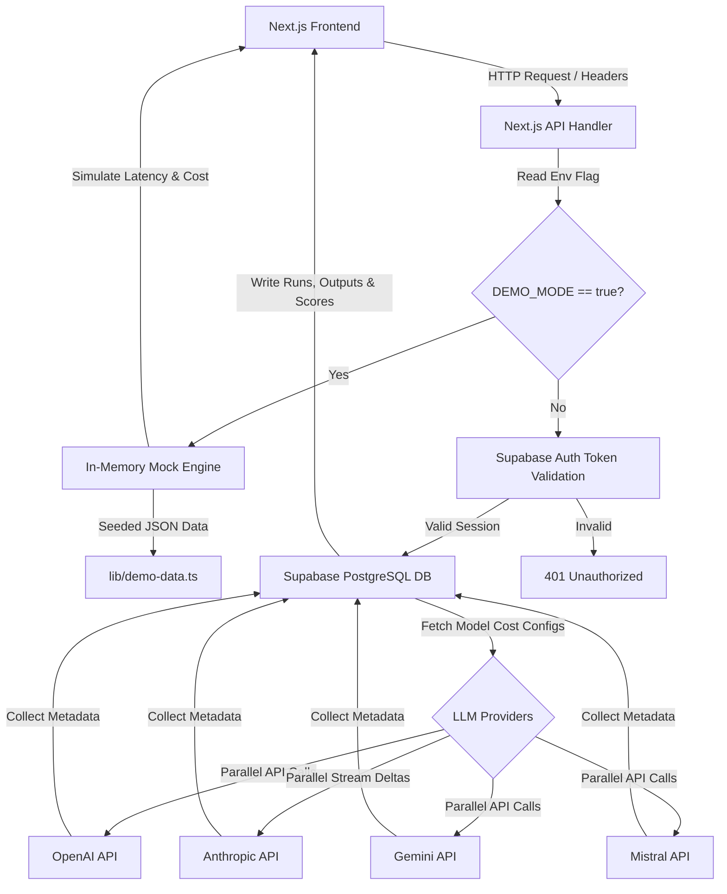

# Umbono — AI Evaluation Dashboard

[](https://nextjs.org/)
[](https://www.typescriptlang.org/)
[](https://tailwindcss.com/)
[](https://supabase.com/)
[](https://openai.com/)
[](https://www.anthropic.com/)
[](https://deepmind.google/technologies/gemini/)

Umbono is a multi-provider AI prompt evaluation dashboard designed to compare model response quality, latency, and token cost across OpenAI, Anthropic, Google, and Mistral. It enables teams to run prompt templates in parallel, apply weighted human evaluation criteria, and aggregate results into a leaderboard for model selection.

This repository features a **zero-dependency, self-contained Portfolio Showcase Demo Mode** alongside its fully-typed production codebase.

---

## 🚀 Interactive Portfolio Demo

To experience the dashboard immediately without setting up databases or AI provider API keys:

```bash
# Clone the repository
git clone https://github.com/your-username/umbono-dashboard.git
cd umbono-dashboard

# Install dependencies and start local Showcase Demo Mode
make install
make demo
```

Open [http://localhost:3000](http://localhost:3000) in your browser.

---

## 📋 Overview

### The Problem
When deploying LLM applications, choosing the right model is a multi-dimensional challenge. A model with the highest response quality might be too slow or expensive for production, while a faster model may fail specific behavioral guidelines. Teams need an objective tool to evaluate responses in parallel, score them against custom weighted criteria, and keep track of cost/performance leaderboards.

### The Solution
**Umbono** provides a central workspace to:
- Test prompts simultaneously across different LLM providers and models.
- Capture physical latency metrics and exact API input/output token usage.
- Grade response samples using structured evaluation criteria (e.g., sliders for clarity and helpfulness, booleans for custom behavioral alignment like "Ubuntu Alignment").
- Compile and rank models on a global leaderboard updated dynamically via weighted averages.

### Target Audience
Built for developers, prompt engineers, and product teams building LLM-backed applications who need a data-driven model selection framework.

---

## ✨ Key Features

- **Parallel Provider Execution**: Execute prompt comparisons simultaneously across OpenAI (GPT-4o), Anthropic (Claude 3.5 Sonnet), Google (Gemini 1.5 Flash), and Mistral AI.
- **Weighted Scoring System**: Configure human evaluation criteria (e.g., Clarity 30%, Helpfulness 40%, Creativity 20%, Ubuntu Alignment 50%) to score outputs.
- **Dynamic Leaderboard**: Aggregate latency, cost per 1k tokens, specific criteria averages, and overall weighted score.
- **Seeded Evaluation Sets**: Bundle prompts into themed "Eval Sets" to test models under specific scopes (e.g., "Community Safety Review" or "Cost vs Latency Sweep").
- **Supabase Authentication**: Production-ready registration, login, and secure user-profile endpoints.
- **Row-Level Security (RLS)**: Fine-grained SQL security rules in PostgreSQL ensuring users only access their own runs, prompts, and evaluations.

---

## 🛠️ Technical Highlights

- **Provider Abstraction Pattern**: Standardized API execution interfaces wrap diverse SDKs (OpenAI, Anthropic, Google, Mistral) to return consistent shapes for latency, errors, token usage, and costs.
- **Parallel Promise Execution**: Evaluates models concurrently via `Promise.all` in the Next.js API layer to minimize request wait times.
- **Streaming Response Delta Assembly**: Implements Anthropic message delta streaming in the backend to safely handle long-running generation tasks without hitting proxy server timeouts.
- **Dual-Mode Engine Architecture**: The entire application routes its backend API handlers dynamically based on `DEMO_MODE`. When enabled, database writes and external HTTP requests are swapped with in-memory deterministic simulation routines, rendering the repository safe and functional for public web hosting.

---

## 📐 System Architecture

The following diagram illustrates how the Next.js front-end interfaces with API routes and branches based on the configured execution environment:



---

## 💾 Database Schema

The database relies on a PostgreSQL schema designed to support user multi-tenancy:
- **`profiles` / `user_settings`**: Track user roles (Admin, User, Viewer) and custom UI theme and weighted criteria defaults.
- **`models`**: Store active model endpoints, provider tags, and base token input/output costs.
- **`prompts` / `runs`**: Link a run session to the prompt text submitted by a user.
- **`outputs`**: Capture generated text, latency in milliseconds, tokens used, and the calculated weighted score.
- **`evaluation_criteria` / `ratings`**: Model-specific ratings for clarity, helpfulness, and custom boolean checks like "Ubuntu Alignment".

For full schema and RLS setups, see [schema.sql](file:///Users/matthew-schramm-ubundi/Workspace.nosync/Personal/umbono-dashboard/schema.sql) and [rls_policies.sql](file:///Users/matthew-schramm-ubundi/Workspace.nosync/Personal/umbono-dashboard/rls_policies.sql).

---

## 📈 Suggested Areas for Visual Walkthroughs

If you are deploying this as a live showcase, consider capturing screenshots or GIFs of the following key interfaces:
1. **Interactive Evaluator Panel**: Shows the prompt editor, model selector checkboxes, and the progress bar.
2. **Comparison Cards**: Visualizes the response grids from GPT-4o, Claude 3.5 Sonnet, and Gemini 1.5 Flash side-by-side with latency and cost tags.
3. **Interactive Scoring Sliders**: Grading a specific response in real-time and seeing the overall score update instantly.
4. **Leaderboard View**: The summary table showing overall scores, Ubuntu alignment percentages, latencies, and total run counts.

---

## 🛠️ Local Development & Production Setup

To transition from the local demo mode into a fully functioning production environment:

### 1. Database Setup
1. Create a project in [Supabase](https://supabase.com).
2. Open the Supabase **SQL Editor**.
3. Copy, paste, and run the contents of [schema.sql](file:///Users/matthew-schramm-ubundi/Workspace.nosync/Personal/umbono-dashboard/schema.sql) to create the schema and seed active model metadata.
4. Copy, paste, and run [rls_policies.sql](file:///Users/matthew-schramm-ubundi/Workspace.nosync/Personal/umbono-dashboard/rls_policies.sql) to set up Row-Level Security.

### 2. Environment Variables Configuration
Create a `.env.local` file in the root of the project:

```env
# Disable Demo Mode
DEMO_MODE=false
NEXT_PUBLIC_DEMO_MODE=false

# Supabase Keys (Found in Supabase settings -> API)
NEXT_PUBLIC_SUPABASE_URL=https://your-project-id.supabase.co
NEXT_PUBLIC_SUPABASE_ANON_KEY=eyJhbGciOi...
SUPABASE_SERVICE_ROLE_KEY=eyJhbGciOi...

# AI Provider API Keys (Only configure the ones you want to enable)
OPENAI_API_KEY=sk-...
ANTHROPIC_API_KEY=sk-ant-...
GOOGLE_API_KEY=AIzaSy...
MISTRAL_API_KEY=your_mistral_key
```

### 3. Run the Production Development Server
Ensure you run under the non-demo script command:
```bash
make dev
```
Test that you can register users and query actual LLM endpoints.

---

## 📝 Engineering Lessons & Trade-offs

### Next.js Serverless Request Timeouts vs. Streaming Deltas
When running a batch evaluation of multiple prompts in production, API calls to providers like Anthropic can occasionally take longer than 10–15 seconds, risking serverless function timeouts on hosts like Vercel. To mitigate this risk for Anthropic models, the backend implements `anthropic.messages.stream` to handle tokens dynamically. For other providers, promises are fired in parallel (`Promise.all`) to avoid sequential queuing delay.

### Numeric Score Integrity between DB and Frontend
Evaluation criteria scores are represented by floating-point values computed on the fly. In the PostgreSQL schema, scores are stored in numeric columns to maintain precision, but to prevent float arithmetic drift on the client (e.g., displaying `4.199999999999999` overall score), API routes like `pages/api/leaderboard.ts` apply explicit rounding constraints (`toFixed(2)` and `toFixed(6)`) before returning payload JSON to the UI.

---

## 🔒 Project Status
- **Status**: Production-Inspired Portfolio Prototype.
- **Current Version**: `0.1.0`.
- **Maintenance**: Maintained as a public engineering portfolio showcase. Safe for deployment.
