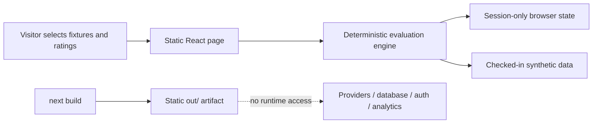

# Umbono — deterministic AI evaluation showcase

Umbono is a public-safe portfolio demonstration of a model-evaluation workflow. It lets a visitor open an evaluation set, run several synthetic model profiles in parallel, compare their outputs and operational metadata, apply a human-defined weighted rubric, and see an in-memory leaderboard update.

Frontend changes should follow the product design contract in [DESIGN.md](DESIGN.md).

Everything shown is simulated. Model identities, prompts, outputs, quality scores, latency, token counts, rates, costs, and history are deterministic synthetic fixtures. The project makes no live-provider performance claim.

## Run locally

Requirements: Node.js 20.9 or newer and npm.

```bash
git clone https://github.com/Schramm2/umbono-dashboard.git
cd umbono-dashboard
npm ci
npm run dev
```

Open [http://localhost:3000](http://localhost:3000). No environment file, credential, account, database, or external service is required.

## Verify

```bash
npm run verify
```

This runs focused calculation tests, TypeScript checks, lint, and the static production build. The deployable artifact is written to `out/`.

## What the showcase proves

- Deterministic parallel simulation across independently selected synthetic model profiles.
- A complete human evaluation rubric with explicit, normalized weights.
- Reproducible ranking, nearest-rank p95 latency, token accounting, and cost calculations.
- A no-credential journey whose run and score state exists only in browser memory.
- A fail-closed static build with no runtime API, provider SDK, database client, authentication, analytics, or mutation path.

The calculation definitions and exact proof points are documented in [docs/calculations.md](docs/calculations.md). A reproducible evidence-capture sequence is in [docs/media/shot-list.md](docs/media/shot-list.md).

## Architecture and safety boundary



`next.config.js` permanently produces a static export and recognizes only `.tsx` pages. The canonical interface imports one pure evaluation engine and performs no `fetch` calls. Environment variables cannot enable another mode.

Historical API, provider, authentication, schema, and RLS files remain in the existing repository history for review; they are not compiled, routed, deployed, or copied by the standalone export. `scripts/export-showcase.sh` creates an allowlisted source tree and rejects production-integration or machine-local references.

## Standalone export

Create a private review tree at an explicit new path:

```bash
npm run export:showcase -- /absolute/path/to/umbono-showcase-review
cd /absolute/path/to/umbono-showcase-review
npm ci
npm run verify
```

The script refuses to overwrite an existing directory. Do not create or publish a new repository until ownership and attribution approval is recorded.

## Publication status

The current repository is public and MIT-licensed to Matthew Schramm, but repository history also shows an Ubundi work context. No separate written confirmation of republication authority or final attribution wording was found during the readiness audit. Before a new showcase repository, deployment, portfolio case study, or GitHub homepage update, confirm publication rights and choose approved wording for the Ubundi relationship.

## Limitations

- No model provider is called and no result is a live benchmark.
- “Latency” is deterministic fixture data, not elapsed wall-clock time.
- Token counts and USD costs are illustrative calculations from synthetic rates.
- The leaderboard combines checked-in synthetic history with scores added during the current browser session.
- Refreshing the page resets the session; there is intentionally no persistence or authentication.

## License

[MIT](LICENSE). Publication approval for the sanitized standalone showcase remains a separate governance requirement described above.
