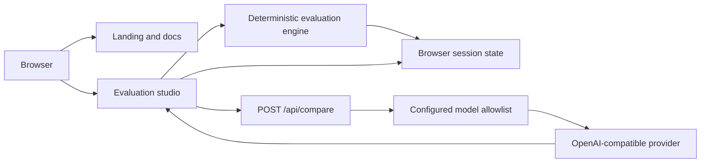

# Umbono

Umbono is an open-source studio for reproducible multi-model AI evaluations. It runs the same prompt across several models, captures operational metadata, applies a visible human rubric, and turns the evidence into a comparison you can explain.

The project has two first-class modes:

- **Demo mode** uses deterministic checked-in fixtures. It needs no account, database, API key, or external request.
- **Live mode** sends parallel requests to an OpenAI-compatible endpoint. Keys remain server-side and model access is controlled by an environment allowlist.

## Why Umbono exists

Choosing a model is rarely one metric. Teams need to compare response quality, latency, token usage, cost, and human judgment without losing the context behind the final rank. Umbono keeps that decision trail in one workflow.

Use it to:

- compare one prompt across one to four models;
- inspect model output beside latency, token usage, and estimated cost;
- score outputs with an explicit weighted rubric;
- rank models using documented, tested calculations;
- demonstrate an evaluation workflow without exposing credentials or claiming fake live benchmarks.

## Quick start

Requirements: Node.js 20.9 or newer and npm.

```bash
git clone https://github.com/Schramm2/umbono-dashboard.git
cd umbono-dashboard
npm ci
npm run setup
npm run dev
```

Open [http://localhost:3000](http://localhost:3000), then select **Open studio**. The default demo mode works immediately.

`npm run setup` copies `.env.example` to `.env.local` only when `.env.local` does not already exist.

## Enable live comparisons

Edit `.env.local`:

```dotenv
UMBONO_API_KEY=your-server-side-key
UMBONO_BASE_URL=https://your-provider.example/v1
UMBONO_MODELS=your-model-id,another-model-id
```

Restart the development server. The studio will report **Live provider ready** and enable the Live mode control.

Production builds remain demo-only by default. To enable billed live requests in production, set `UMBONO_ALLOW_LIVE_IN_PRODUCTION=true` only after adding authentication and rate limiting at the deployment layer or provider gateway.

Model IDs must match the IDs accepted by your configured endpoint. Umbono calls `POST {UMBONO_BASE_URL}/chat/completions` with a bearer token and an OpenAI-compatible chat completion body.

Optional safeguards and cost configuration:

```dotenv
UMBONO_MAX_TOKENS=800
UMBONO_REQUEST_TIMEOUT_MS=45000
UMBONO_MODEL_PRICING={"your-model-id":{"input":0.4,"output":1.6}}
```

Pricing values are USD per million tokens. When a model has no configured pricing, Umbono labels cost as unavailable instead of inventing a rate.

See [docs/configuration.md](docs/configuration.md) for the complete reference and troubleshooting guide.

## Product surfaces

- `/` explains the product, workflow, trust model, and fastest path to a first run.
- `/studio` contains the working comparison, human rubric, session ranking, and demo/live mode switch.
- `/docs` provides an in-product quick start and deployment guide.
- `/api/status` reports whether live mode is available without exposing credentials.
- `/api/compare` performs bounded server-side provider requests.

## Architecture



The live adapter is deliberately small:

- provider credentials are read only on the server;
- the browser receives model IDs and labels, never the API key;
- prompts are limited to 20,000 characters;
- each run accepts one to four unique allowlisted models;
- each model request has a configurable timeout;
- cross-origin browser requests are rejected;
- production live mode requires an explicit operator opt-in;
- Umbono does not include persistence, authentication, or analytics.

Read [docs/architecture.md](docs/architecture.md) for trust boundaries and extension points. Calculation definitions live in [docs/calculations.md](docs/calculations.md).

## Repository layout

```text
pages/
  index.tsx            Public landing page
  studio.tsx           Evaluation workspace
  docs.tsx             In-product setup guide
  api/compare.tsx      Server-side comparison endpoint
  api/status.tsx       Safe configuration status
lib/
  evaluation.ts        Deterministic scoring and demo engine
  provider.ts          OpenAI-compatible live adapter
docs/                  Operator and contributor documentation
tests/                 Calculation and provider-adapter tests
styles/globals.css     Shared product design system
```

Historical Supabase, auth, and provider-specific API files remain in the repository for provenance, but the active product does not route, compile, or depend on them. The active API routes use the `.tsx` extension selected by `next.config.js`.

## Commands

| Command | Purpose |
| --- | --- |
| `npm run setup` | Create `.env.local` from the checked-in example without overwriting an existing file. |
| `npm run dev` | Start the local Next.js development server. |
| `npm run demo` | Start the application with live mode forcibly disabled. |
| `npm run test` | Run focused calculation and provider-adapter tests. |
| `npm run typecheck` | Check the active TypeScript product surface. |
| `npm run lint` | Run ESLint and Next.js quality rules. |
| `npm run build` | Create the production Next.js build. |
| `npm run start` | Serve a completed production build. |
| `npm run verify` | Run tests, type checking, lint, and the production build. |
| `npm run export:showcase -- /absolute/new/path` | Create a standalone demo-only source tree without overwriting the target. |

## Standalone demo export

Maintainers can produce a reviewable static showcase without live API routes:

```bash
npm run export:showcase -- /absolute/new/path
cd /absolute/new/path
npm ci
npm run verify
```

The exporter copies an allowlisted source set, substitutes a static Next.js configuration, scans for common secret and machine-local patterns, and refuses to overwrite an existing path. The resulting studio intentionally falls back to deterministic demo mode because no API routes are included.

## Design and product contract

Frontend changes should follow [DESIGN.md](DESIGN.md). Umbono uses graphite neutrals, lime as the only action color, restrained motion, strong keyboard focus, and distinct rules for the public landing page and operational studio.

## Contributing

Issues and focused contributions are welcome. Start with [CONTRIBUTING.md](CONTRIBUTING.md), run `npm run verify`, and keep new provider integrations behind server-only boundaries.

Security reports should follow [SECURITY.md](SECURITY.md). Please do not open public issues containing provider keys, prompts with sensitive data, or security exploit details.

## Current limitations

- Live mode supports OpenAI-compatible chat completion APIs, not provider-specific SDKs.
- Runs and human scores are session-only and reset on refresh.
- The included leaderboard history is synthetic and is never presented as a live model benchmark.
- Estimated cost appears only when maintainers or operators configure explicit rates.
- Umbono is an evaluation workflow reference and portfolio project, not a production governance system.

## License

[MIT](LICENSE) © Matthew Schramm.
