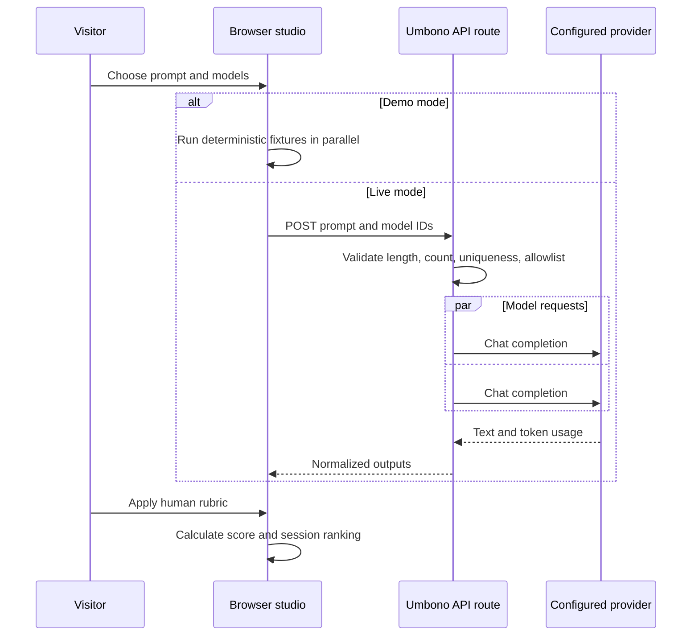

# Architecture

Umbono separates public explanation, browser-side evaluation state, deterministic calculations, and live provider access into explicit boundaries.

## Runtime flow

## Trust boundaries

### Browser

The browser owns selected prompts, current run output, rubric values, and session ranking. It does not receive provider credentials. Refreshing resets this state.

### API routes

`/api/status` exposes only provider hostname, configured model IDs, display labels, and pricing availability.

`/api/compare` validates:

- one non-empty prompt with at most 20,000 characters;
- one to four unique model IDs;
- every model ID is present in the server allowlist.

Each provider request receives its own abort timeout. Requests run in parallel and failures are returned per model so one failed provider response does not hide successful outputs.

### Provider

Umbono assumes an OpenAI-compatible chat completion contract. The configured provider receives the prompt, selected model ID, and output token limit. Operators are responsible for the provider's retention, privacy, billing, and content policies.

## Calculation boundary

`lib/evaluation.ts` owns weighted scoring, nearest-rank p95, cost calculations, deterministic simulation, and leaderboard aggregation. The module has no network or persistence dependency and is covered by focused tests.

`lib/provider.ts` owns environment parsing, server-side request construction, response normalization, request timeouts, and optional estimated cost.

## Extension points

### New rubrics

Add criterion definitions and update the rating UI in one change. Criterion weights are normalized by `calculateWeightedScore`, so weights do not need to sum to exactly one, but documentation and visible percentages must remain consistent.

### Provider-specific adapters

Add a server-only adapter beside `lib/provider.ts`, normalize its result to `ProviderRun`, and select it through explicit server configuration. Do not import provider SDKs into page or browser modules.

### Persistence

Persistence is intentionally absent. Adding it requires explicit decisions for authentication, tenancy, data retention, deletion, encryption, row-level authorization, and prompt sensitivity. Do not connect historical Supabase code without a new security design.
