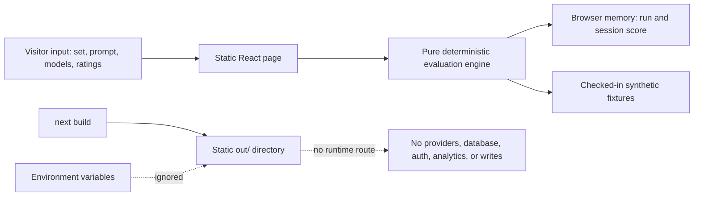

# Umbono showcase readiness record

## Canonical implementation

`umbono-dashboard` is the canonical showcase. It owns the deterministic evaluation engine, the complete interactive journey, focused calculation tests, static build, and sanitized export script.

`Multi-Model-Prompt-Evaluation-Dashboard` is a private historical frontend. It contains a broader Vite/React interface, but it depends on a separate backend, duplicates the product surface, and includes historical Ubundi attribution. Leave it private and out of the showcase. No history or files were deleted as part of this remediation.

The legacy API, provider, auth, database, schema, and RLS files in this working repository are historical implementation evidence only. Next.js is configured to recognize `.tsx` pages exclusively, the canonical TypeScript configuration excludes those files, and the export script does not copy them.

## Publication and attribution status

Evidence found:

- `umbono-dashboard` is already a public GitHub repository with an MIT license naming Matthew Schramm.
- The older frontend is private.
- Repository history includes commits using an Ubundi email identity.
- Portfolio migration guidance says not to republish Ubundi-origin code under a new license without confirmed rights.

No written approval or agreed attribution wording was found. The exact remaining external decision is: confirm that Matthew has authority to publish the sanitized Umbono showcase and choose whether the case study should say “created while at Ubundi,” use different approved wording, or omit company attribution. Until then, do not publish a new repository, deploy the site, update GitHub metadata, or place captures on the public portfolio.

## Pre-remediation trust boundary

The browser called Next.js API routes. An environment-controlled `DEMO_MODE` branch selected either deterministic data or Supabase authentication, database mutations, and live model-provider SDKs. Provider and database clients were imported at module scope. A missing, changed, or malicious deployment configuration could therefore expose production paths.

## Showcase trust boundary

Controls:

- `next.config.js` locks the artifact to a static export and recognizes only `.tsx` pages, so historical `.ts` API routes are not routes.
- `pages/index.tsx` imports only React, Next metadata, and `lib/evaluation.ts`; it uses no `fetch`, credentials, persistence, or analytics.
- `lib/evaluation.ts` contains all synthetic identities, prompts, outputs, timings, token counts, rates, scoring, and aggregation.
- `.env.example` documents that no configuration is accepted; `lib/demo-mode.ts` is unconditionally `true` for direct review of historical files.
- `scripts/export-showcase.sh` uses an allowlist and fails if production integration or machine-local patterns appear in the exported tree.

## Calculation definitions

- Weighted score: convert each 1–5 scale to 0–1, map the boolean criterion to 0 or 1, take the weighted mean, then return to a 0–5 scale. Current weights total 100%.
- Ranking: overall score descending, then p95 latency ascending, then model name.
- p95 latency: nearest-rank percentile over the model’s synthetic evaluation records.
- Tokens: input plus output tokens per record; totals are summed by model.
- Cost: `(input tokens / 1,000,000 × input rate) + (output tokens / 1,000,000 × output rate)` using explicitly synthetic rates.
- Cost per 1k: total illustrative cost divided by total tokens, multiplied by 1,000.

## Export and deployment plan

Run `npm run export:showcase -- /absolute/review/path` to create an allowlisted source tree. Review it, run `npm ci && npm run verify` inside it, and inspect the generated `out/` directory. Only after rights approval may that reviewed tree become a new one-root-commit repository.

The safest deployment is a static host serving `out/` with no functions, runtime environment variables, server-side rendering, identity service, data store, or analytics. No intended live URL is recorded in current GitHub or portfolio metadata. Reserve a final URL only after approval; `https://umbono.mattschramm.com/` is the recommended portfolio-owned destination if that DNS pattern is acceptable. The current GitHub repository homepage is unset and should eventually point to the approved live URL.

## Verifiable case-study proof points

1. Deterministic parallel simulation: `runParallelSimulation` evaluates independently selected synthetic model profiles with `Promise.all`; repeated input returns identical output. Verify with `tests/evaluation.test.ts` and the evaluator journey.
2. Auditable human weighting: `calculateWeightedScore` validates complete ratings, normalizes weights, and produces a 0–5 score. Verify the max, mixed, missing, unknown, and range cases in `tests/evaluation.test.ts`.
3. Reproducible operational aggregates: `aggregateLeaderboard`, `nearestRankPercentile`, and `calculateCost` implement ranking, p95, token totals, and cost per 1k. Verify with focused tests and by scoring a response, which updates the in-memory leaderboard.

Limitations: every identity, prompt, output, score, latency, token count, rate, cost, and historical record is synthetic. The showcase proves evaluation and calculation behavior, not live-provider performance, persistence, authentication, production scale, or model quality.
